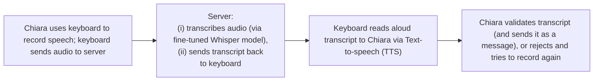
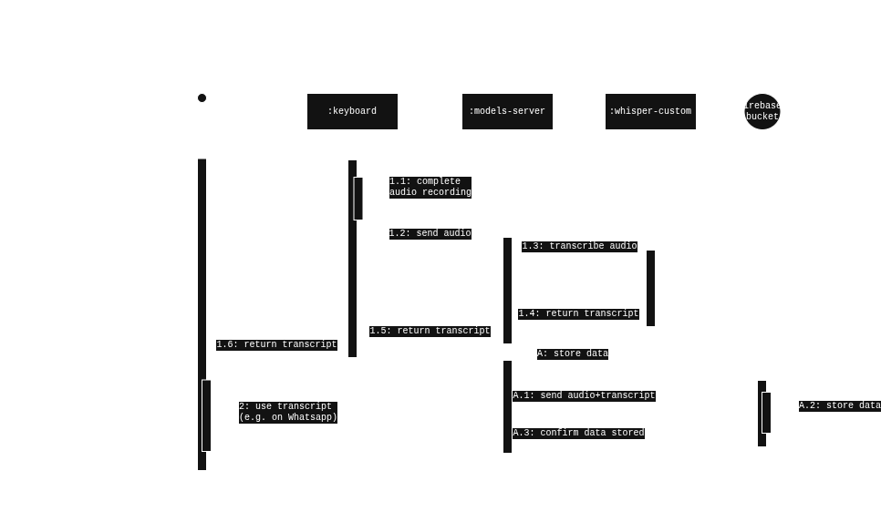
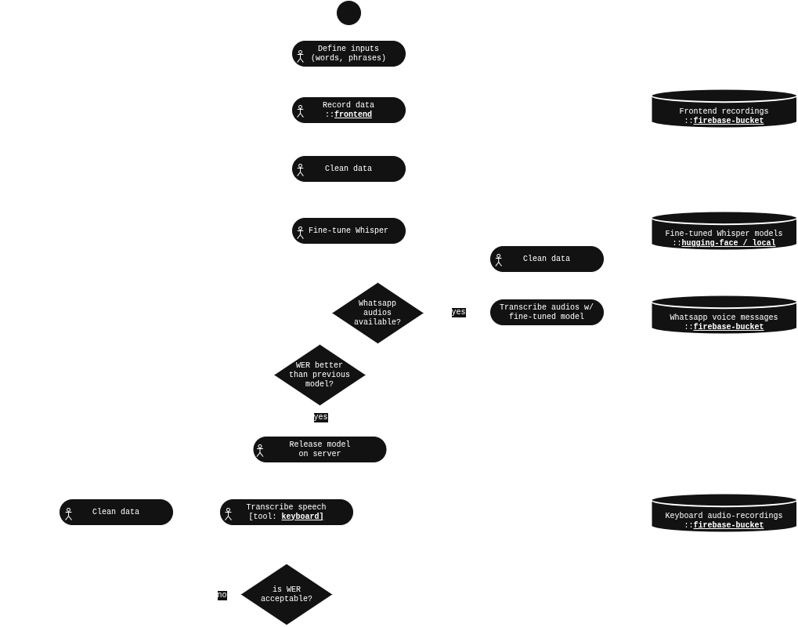
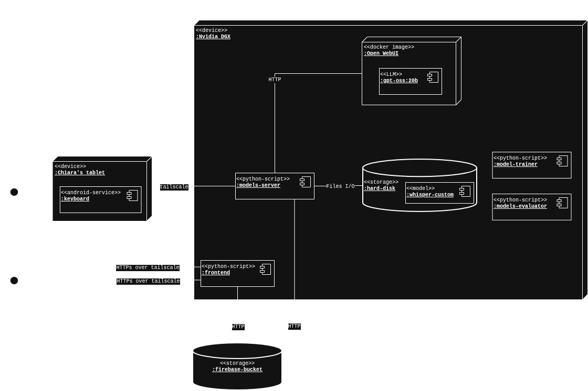

# 1. Introduction
`chiara-speech2text` is a software system for Automatic Speech Recognition (ASR) for users with atypical speech.

An introduction to the project, along with videos / screenshots / demos, is available at the [project page](https://luca-randazzo.github.io/chiara-speech2text.github.io/).

This document provides a technical description of the system and this repository. 

# 2. System description

## Modules
The system is composed of the following modules:
- `frontend`: webapp to create and curate the datasets used to train the model, including functionalities to:
    - record users' speech (users can also upload custom words/phrases on which they'd like to train the model) 
    - curate the dataset (e.g. edit transcripts, listen- and delete- low quality recordings which are not suited for model-training purposes)
- `model-trainer`: Python notebooks to:
    - import datasets generated by `frontend` module
    - train fine-tuned voice recognition models (based on OpenAI Whisper) on the recorded dataset
- `fine-tuned models`: binary files containing the fine-tuned models (bias, weights, architecture, etc), as output'd by `model-trainer`
- `model-server`: Python webserver exposing services that:
    - (i) accept audio inputs, and
    - (ii) return corresponding transcripts exploiting transcription via the `fine-tuned models`  
- `keyboard`: custom Android keyboard that allows to:
    - record user's speech
    - send recorded audios to `model-server`
    - show and edit transcripts returned by `model-server`   
    - deploy transcript exposing a standard Android input-method (keyboard), for seamless use e.g. in Whatsapp
    - provide suggestions for words similar to the recognized ones (using Levenshtein distance)
- `models-evaluator`: Python notebooks to evaluate amd compare performance (e.g. WER) of different fine-tuned models
- `storage`: Google Firebase storage bucket to store audio recordings and transcripts
- `utils`: Python utils

## Repo structure
The repo is organised as follows:
```
chiara-speech2text/
├── assets/            # Sample audio files
├── docs/              # Documentation and analysis files
├── envs/              # Environment variables
├── frontend/          # Webapp for dataset recording/curating
├── model-server/      # FastAPI server for GPU-based inference
├── model-trainer/     # Training notebooks for fine-tuning ASR models
├── models-evaluator/  # WER evaluation notebooks
└── utils/             # Data processing utilities
```

## Diagrams
### Main use-flow
The main use flow is hown in the diagram below


### Keyboard use
The diagram below shows how the keyboard is used


### Fine-tuning process
The following process was employed to iteratively fine-tune models for Chiara:



These steps were followed:
1. Luca and Chiara (with help from their father and mother), defined a set of inputs (words / phrases) they deemed useful for Chiara's communication (based on what she typically communicates over Whatsapp)
2. Chiara recorded her speech corresponding to the inputs through `frontend` module.
    - Audios + corresponding text is stored on a firebase storage
3. Luca cleaned audios (e.g. removed bad recordings) to ensure clean data was available for models training 
4. A first model was fine-tuned using the labeled data (audios + text) recorded through the `frontend`
5. After ~1h of recorded data, the fine-tuned model was used to transcribe a 1st batch of available Whatsapp audio messages (which Chiara exchanged with Luca over previous years)
6. Luca manually labeled available Whatsapp audios (i.e. listened to audios and edited the transcripts to ensure they matched)
7. The edited data was used to fine-tune a new model
9. Steps 6-7 were iteratively repeated till ~10h of labeled data (recordings+transcripts) was available. Upon this threshold the system was capable of reliably transcribing Chiara's speech with WER ~15

## Deployment
An example of how modules can be deployed is shown in the diagram and table below.



| Module            | Location                                     |
| ----------------- | -------------------------------------------- |
| frontend          | Nvidia DGX Spark, or Google Cloud Run        |
| model-trainer     | Nvidia DGX Spark, or Google Colab            |
| fine-tuned models | Nvidia DGX Spark, or Hugging Space           |
| model-server      | Nvidia DGX Spark, or Google Cloud Run        |
| keyboard          | Final users's tablet                         |
| models-evaluator  | Nvidia DGX Spark                             |
| storage           | Google Firebase bucket                       |
| utils             | development PC (e.g. Nvidia DGX Spark)       |

# 3. Installation, Setup, Use
To install, use, deploy the system, see instructions in [readme-setup.md](readme-setup.md).

# 4. Requirements
- Some coding skills are required to install and use this system
- A GPU is required for fast (<1s) inference (transcription). CPUs generate transcriptions within ~8s
- ~8h of labeled data is required to start seeing acceptable transcrition performance (WER ~15)
- The system currently requires paid-services for hosting (data and code)
    - Storage costs: https://firebase.google.com/pricing 
    - Hosting costs: https://cloud.google.com/run/pricing 

# 5. Disclaimers
- The data schemas have been designed to keep track of audio information, ground-truth and additional information usable for Direct Preference Optimization (DPO) and other techniques 
- More than 90% of the code is AI-generated: the code is not clean, neither very well architected. The main driving force during development has always been functionality, not code-clean-ness / reusability
- Credits: The starting point for this project was the [Google Euphonia project](https://sites.research.google/euphonia/about/)
